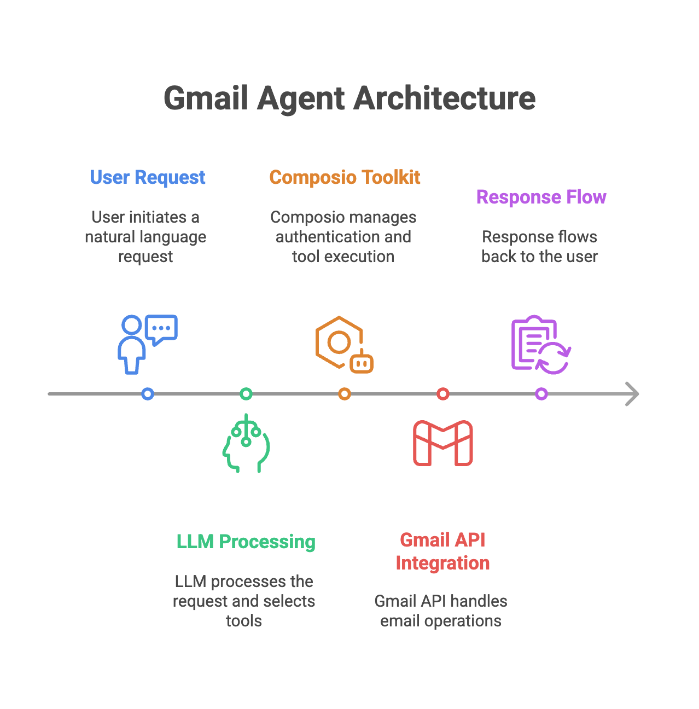
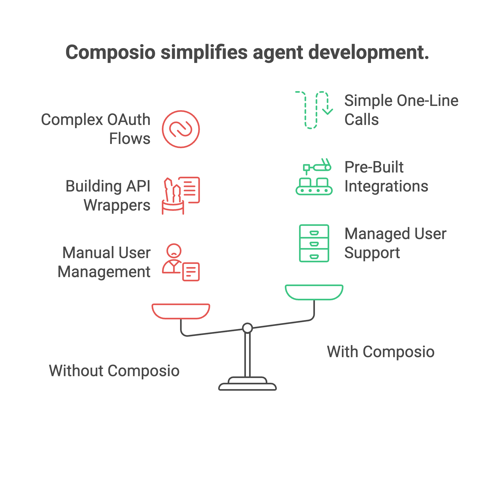

# Gmail Agent

A simple gmail agent built using Composio and OpenAI

## Setup

1. **Clone the repository**
   ```bash
   git clone git@github.com:composiohq/simple-gmail-agent
   cd simple-gmail-agent/
   ```

2. **Ensure you have [UV](https://docs.astral.sh/uv/getting-started/installation/)**
   ```bash
   uv --version
   ```

3. **Create and activate a virtual environment**
   ```bash
   make env
   source .venv/bin/activate
   ```

4. **Configure environment variables**
   - Copy `.env.example` to `.env` and fill in your Composio and OpenAI API keys:
     ```bash
     cp .env.example .env
     # Edit .env and set COMPOSIO_API_KEY and OPENAI_API_KEY
     ```
   - Get composio API key from the [platform](https://platform.composio.dev)

## Design

### What is an AI Agent?

An AI agent is an intelligent system that understands natural language requests and autonomously executes actions to fulfill them. Unlike traditional software, AI agents can understand context, make decisions, and interact with external systems through tools and APIs.

### Architecture Overview

This Gmail agent demonstrates a clean, simple AI agent architecture:



**Key Components:**

1. **Natural Language Processing** (LLM)
   - Understands user requests and decides which Gmail actions to take

2. **Tool Management** (Composio)
   - Provides pre-built Gmail integrations with automatic authentication
   - Manages user connections securely and executes tools safely

3. **Gmail Integration**
   - Fetch emails, send emails, and create drafts

### The Role of Composio

Composio serves as the **managed toolkit layer** that significantly simplifies agent development.



**🔐 Authentication Made Simple**
```python
# Without Composio: Complex OAuth flows, token management, refresh logic
# With Composio: One line of code
composio_client.toolkits.authorize(user_id=user_id, toolkit="GMAIL")
```

**🛠️ Pre-built Integrations**
- Instead of building Gmail API wrappers from scratch, get production-ready tools instantly
- Over 500+ integrated applications available
- Consistent interface across all tools

**👥 Multi-user Support**
- Each user can connect their own Gmail account
- Isolated authentication per user
- Secure credential management

**🔄 Tool Execution**
```python
# Composio handles the complex API calls, error handling, and response formatting
tools = composio_client.tools.get(user_id=user_id, tools=["GMAIL_FETCH_EMAILS"])
result = composio_client.provider.handle_tool_calls(response=response, user_id=user_id)
```

### Agent Workflow

1. **Client Initialization**: Create Composio and OpenAI clients
   ```python
   from composio import Composio
   from composio_openai import OpenAIProvider
   from openai import OpenAI
   
   # Initialize clients
   composio_client = Composio(provider=OpenAIProvider(), api_key=composio_api_key)
   openai_client = OpenAI(api_key=openai_api_key)
   ```

2. **User Authentication**: Check if user has an active Gmail connection, create one if needed
   ```python
   # Check for existing active connection
   connected_accounts = composio_client.connected_accounts.list(user_ids=[user_id])
   has_active_connection = any(account.status == "ACTIVE" for account in connected_accounts.items)
   
   if not has_active_connection:
       # Create connection and get OAuth URL
       connection_request = composio_client.toolkits.authorize(user_id=user_id, toolkit="GMAIL")
       print(f"Please visit: {connection_request.redirect_url}")
       connection_request.wait_for_connection()  # Wait for user to complete OAuth
   ```

3. **Request Processing**: User sends a natural language request

4. **Tool Retrieval & LLM Processing**: Get Gmail tools and let LLM decide which to use
   ```python
   # Get available Gmail tools for the user
   tools = composio_client.tools.get(
       user_id=user_id,
       tools=["GMAIL_FETCH_EMAILS", "GMAIL_SEND_EMAIL", "GMAIL_CREATE_EMAIL_DRAFT"]
   )
   
   # LLM analyzes prompt and selects appropriate tools
   response = openai_client.chat.completions.create(
       model="gpt-4.1",
       tools=tools,
       messages=[{"role": "user", "content": user_prompt}]
   )
   ```

5. **Tool Execution**: Composio executes the selected Gmail tools with user's authenticated connection
   ```python
   # Composio handles Gmail API calls automatically
   result = composio_client.provider.handle_tool_calls(
       response=response, 
       user_id=user_id
   )
   return result
   ```

### Deployment Options

The agent supports two deployment modes:

**CLI Mode**: Direct command-line interaction
```bash
python simple_gmail_agent/run.py --user_id john_doe --prompt "Send email to team about meeting"
```

**API Mode**: RESTful web service with FastAPI

```
python simple_gmail_agent/server/run.py
```

```bash
curl -X POST "http://localhost:8000/run_gmail_agent" \
  -H "Content-Type: application/json" \
  -d '{"prompt": "Show me my latest emails"}'
```

## Usage

The Gmail agent can be used in two ways: through a command-line interface (CLI) for quick interactions, or as a web API for integration into larger applications.

### CLI Usage

The CLI provides direct, interactive access to the Gmail agent from your terminal.

#### First Time Setup

1. **Complete the [Setup](#setup) steps** to install dependencies and configure environment variables.

2. **Run your first command**:
   ```bash
   python simple_gmail_agent/run.py --user_id your_unique_id --prompt "Show me my latest emails"
   ```

3. **Connect your Gmail account**: On first run, you'll see a message like:
   ```
   ==== Please visit the following URL to connect your account: ====
   https://foundry.composio.dev/api/v3/s/EvJpNrJU
   =================================================================
   ```
   
   Visit the URL, authorize Gmail access, and the agent will automatically continue.

#### Example Commands

**Fetch Recent Emails**:
```bash
python simple_gmail_agent/run.py --user_id john_doe --prompt "Show me my 5 most recent emails"
```

**Send an Email**:
```bash
python simple_gmail_agent/run.py --user_id john_doe --prompt "Send an email to alice@company.com with subject 'Meeting Follow-up' and tell her thanks for the productive meeting today"
```

**Create Email Draft**:
```bash
python simple_gmail_agent/run.py --user_id john_doe --prompt "Create a draft email to the team about next week's project review meeting"
```

**Complex Queries**:
```bash
python simple_gmail_agent/run.py --user_id john_doe --prompt "Find emails from last week about the budget proposal and create a summary"
```

### API Usage

The FastAPI server provides RESTful endpoints for programmatic access, perfect for integrating into web applications or other services.

#### Starting the Server

1. **Start the FastAPI server**:
   ```bash
   cd simple_gmail_agent/server
   python run.py
   ```
   
   The server will start at `http://localhost:8000`

2. **View API documentation**: Visit `http://localhost:8000/docs` for interactive API documentation.

#### API Endpoints

**🤖 Run Gmail Agent**
```bash
curl -X POST "http://localhost:8000/run_gmail_agent" \
  -H "Content-Type: application/json" \
  -d '{
    "prompt": "Show me my latest 3 emails"
  }'
```

**🔗 Create Gmail Connection**
```bash
curl -X POST "http://localhost:8000/connection/create" \
  -H "Content-Type: application/json" \
  -d '{}'
```

**📧 Fetch Emails Directly**
```bash
curl -X POST "http://localhost:8000/actions/fetch_emails" \
  -H "Content-Type: application/json" \
  -d '{
    "user_id": "john_doe",
    "limit": 5
  }'
```

**📤 Send Email Directly**
```bash
curl -X POST "http://localhost:8000/actions/send_email" \
  -H "Content-Type: application/json" \
  -d '{
    "user_id": "john_doe",
    "email_recipient": "colleague@company.com",
    "email_subject": "Project Update",
    "email_body": "Here is the latest update on our project..."
  }'
```

**📝 Create Email Draft**
```bash
curl -X POST "http://localhost:8000/actions/create_email_draft" \
  -H "Content-Type: application/json" \
  -d '{
    "user_id": "john_doe", 
    "email_recipient": "manager@company.com",
    "email_subject": "Weekly Report",
    "email_body": "Please find attached this week's progress report."
  }'
```

### Integration Examples

**Python Integration**:
```python
import requests

# Run the agent
response = requests.post("http://localhost:8000/run_gmail_agent", 
                        json={"prompt": "Send a thank you email to our new client"})
print(response.json())
```

**JavaScript/Node.js Integration**:
```javascript
const response = await fetch('http://localhost:8000/run_gmail_agent', {
  method: 'POST',
  headers: { 'Content-Type': 'application/json' },
  body: JSON.stringify({ 
    prompt: 'Show me emails from this week about the product launch'
  })
});
const result = await response.json();
console.log(result);
```

### Tips and Best Practices

**🎯 Effective Prompts**:
- Be specific: "Send email to john@company.com about tomorrow's 2pm meeting" works better than "send email"
- Include context: "Reply to Sarah's email about the budget with our approval"
- Use natural language: The agent understands conversational requests

**🔒 User Management**:
- Use unique, consistent `user_id` values for each person
- Each user maintains their own Gmail connection
- User IDs can be email addresses, usernames, or any unique identifier


### Troubleshooting

**Connection Issues**:
- Ensure your `.env` file has valid `COMPOSIO_API_KEY` and `OPENAI_API_KEY`
- Check that the user has completed Gmail authorization
- Verify the user_id matches exactly between requests

**API Errors**:
- Check the server logs for detailed error messages
- Ensure request payloads match the expected format
- Visit `/docs` endpoint for API schema validation

**Gmail API Limits**:
- Gmail has rate limits; the agent will handle these gracefully
- For high-volume usage, consider implementing request queuing